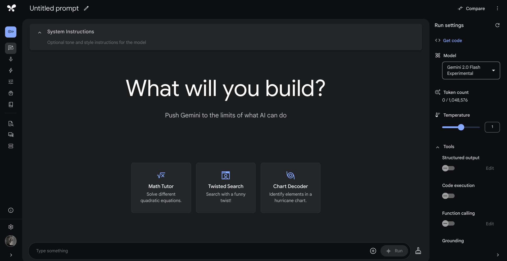

# Computational Thinking & Generative AI

## The Power of Text and LLMs

When you think of "computation" or "programming," what comes to mind? Perhaps you envision a software engineer writing complex code, a data analyst crunching numbers in a spreadsheet, or a mobile app developer creating the next viral game. These are all valid examples of traditional computation, where explicit instructions are written to perform specific tasks.
On the other hand, text generation might evoke images of automated email responses, simple chatbots, or perhaps even grammar and spell-check tools.  These applications, while useful, often involve predefined templates or rule-based systems with limited flexibility. But the true power of text generation lies in its ability to tackle complex, nuanced tasks that were once thought to be exclusive to human intelligence. Consider these examples:

* **Creative Work:** Imagine generating compelling marketing copy for a new product. An AI assistant could analyze product features, target audience demographics, and even competitor messaging to craft original and persuasive content.
* **Analytical Work:**  Instead of manually sifting through mountains of data, an AI could analyze reports, summarize key findings, and even extract insights from unstructured data like meeting transcripts and emails.
* **Automation Work:**  AI-powered chatbots can provide instant, personalized customer support, analyze technical issues, and guide users to relevant solutions, all while communicating in a natural and engaging manner.

Large Language Models (LLMs) are driving this revolution. They can generate human-quality text, translate languages, write different kinds of creative content, and answer your questions in an informative way,  all through simple prompts written in natural language.  This allows for creating ad-hoc solutions to complex business problems on demand, without the need for specialized programming or data science expertise.

However, crafting effective prompts that can elicit the desired output from an LLM requires more than just asking a question. It involves applying the principles of computational thinking:

* **Decomposition:** Breaking down a complex problem into smaller, more manageable sub-problems that the LLM can address.
* **Abstraction:**  Focusing on the essential information and desired outcome, while avoiding unnecessary details that might confuse the model.
* **Algorithmic Thinking:**  Structuring the prompt in a logical and sequential manner, providing clear instructions and constraints.
* **Pattern Recognition:**  Understanding the patterns and nuances of language to craft prompts that resonate with the LLM's training data and elicit the most relevant and accurate responses.

## Understanding Large Language Models (LLMs)

**2.1 What are LLMs?**

Large Language Models (LLMs) are sophisticated AI systems that can understand and generate human-like text.  They are built upon **neural networks**, which are complex structures inspired by the human brain. These networks consist of interconnected **nodes**, processing and transmitting information like neurons.

Imagine each node as a tiny decision-maker,  collectively contributing to the model's ability to understand and generate language.

**2.2  Key Characteristics of LLMs**

To effectively leverage LLMs, it's important to understand some of their key characteristics:

* **Training Data:** LLMs are trained on massive datasets of text and code, which influences their capabilities and potential biases.
* **Architecture:** The arrangement of these interconnected nodes in layers affects the model's performance and efficiency. Information flows through these layers, allowing the model to process and generate text.
* **Parameters:**  Think of parameters as the knobs and dials that control the model's behavior. A simple linear model might need only two parameters to describe a relationship. But human language is vastly more complex, requiring millions or even billions of parameters for LLMs to capture its nuances. For instance, ChatGPT boasts 175 billion parameters, while Gemini has even more!
* **Capabilities:** LLMs demonstrate remarkable capabilities, including:
    * **Text generation:**  Writing stories, poems, articles, and even code.
    * **Translation:**  Accurately translating between multiple languages.
    * **Summarization:**  Condensing lengthy documents into concise summaries.
    * **Question answering:**  Providing informative and comprehensive answers to complex questions.

It's important to note that while some LLMs may excel in multiple areas, trade-offs often exist. A model optimized for creative writing might not be the best at factual summarization. Additionally, LLMs can sometimes "hallucinate," generating incorrect or nonsensical information, highlighting the need for careful evaluation and critical thinking when using these models.

**2.3 Understanding Model Cards**

Now that you have a basic understanding of LLMs, let's explore how companies actually access and utilize these powerful models.

**Accessing LLMs**

There are several ways for businesses to get started with LLMs:

* **Public Cloud Providers:** Companies like Google, Microsoft, and Amazon offer LLMs as a service through their cloud platforms. This allows businesses to access and use these models without the need for significant infrastructure investments.
* **Model Repositories:** Platforms like Hugging Face and Google's Vertex AI Model Garden provide access to a wide range of pre-trained LLMs, often with different capabilities and specializations.
* **Web Services/Subscriptions:** Many LLMs are accessible via web services or APIs (Application Programming Interfaces). This allows developers to integrate these models into their own applications or workflows using simple REST (Representational State Transfer) commands.
* **Self-Hosting:** For companies with specific security or privacy requirements, self-hosting LLMs in their own data centers is also an option, although it requires significant infrastructure and expertise.

**The Need for Model Cards**

With so many LLMs available, choosing the right one for a specific task can be challenging. This is where **model cards** play a crucial role.

To help users choose the right LLM for their needs, model developers provide **model cards**. These cards provide essential information about the model, including:

* **Training data:**  What kind of data was the model trained on?
* **Intended use cases:** What tasks is the model best suited for?
* **Limitations:** What are the model's limitations or potential biases?
* **Ethical considerations:** Are there any ethical implications to consider when using the model?
* **Performance metrics:** How well does the model perform on different tasks?

By understanding the information presented in a model card, you can evaluate an LLM's fitness-for-purpose and make informed decisions about its suitability for your specific business needs.

Check out model cards from Hugging Face for OpenAI, Google, and Meta below.

[Open AI](https://huggingface.co/openai){: .btn .btn-purple .mr-5}
[Google](https://huggingface.co/google){: .btn .btn-blue .mr-5}
[Meta](https://huggingface.co/meta-llama){: .btn .btn-green }

**2.4  Beyond the Basics**

While this provides a high-level overview, there are many other aspects to LLMs, such as:

* **Fine-tuning:** Adapting a pre-trained LLM for specific tasks or domains.
* **Prompt engineering:** Crafting effective prompts to elicit desired outputs.
* **Model evaluation:**  Assessing the performance and limitations of different LLMs.


## Prompt Design as Computational Thinking 

**2.1 Introduction to Prompts**

In traditional computing, we use programming languages to communicate with computers. We write explicit instructions, defining the exact steps and logic for the computer to execute. Whether it's automating office tasks or building complex software, our ability to express solutions through code is crucial.

```python
def calculate_area(length: float, width: float) -> float:
  """Calculates the area of a rectangle.

  Args:
    length: The length of the rectangle.
    width: The width of the rectangle.

  Returns:
    The area of the rectangle.
  """
  return length * width
```

For example, this Python function calculates the area of a rectangle. Its type signature (`calculate_area(length: float, width: float) -> float`) defines how we can interact with it, while the code within its body represents the logic it executes.

Generative AI, however, offers a different paradigm. Instead of rigid programming syntax, we use natural language to communicate with Large Language Models (LLMs).  These models have learned from vast amounts of text data, encoding knowledge and patterns that allow them to understand and respond to human language.

Think of an LLM as a knowledgeable assistant who understands your instructions, can access and process information relevant to your request, and can generate outputs that meet your specific needs.

**Crafting Effective Prompts**

To effectively utilize LLMs, we need to craft prompts that clearly convey our intent.  This involves:

* **Instructions:**  Clearly stating what we want the LLM to do.  For example, "Summarize this article" or "Write a poem about nature."
* **Context:** Providing relevant information that helps the LLM understand the task and generate a more accurate response.  For instance, if you're asking for marketing copy, provide details about the product and target audience.
* **Constraints:** Specifying any limitations or requirements for the output. This could include the desired length, format, or style.

**Beyond Explicit Instructions**

Interestingly, LLMs can also infer instructions and processing logic from various cues:

1. **Examples:** Providing one or more examples of the desired output can guide the LLM's generation process. This is akin to showing, rather than just telling, the model what you want.
2. **Persona or Scenario:** Asking the LLM to adopt a specific persona (e.g., "Imagine you are a financial advisor") or assume a scenario can influence its response and generate more contextually relevant output.
3. **Memory:** LLMs have a form of memory, allowing them to retain and contextualize information from recent interactions. This means that the model's response to a current prompt can be influenced by previous prompts and responses within the same conversation. This allows for more dynamic and engaging interactions.


## Anatomy of a Prompt

**3.1 Required vs. Optional Elements**

Crafting effective prompts is like assembling a puzzle. You need the right pieces in the right places to create a complete and meaningful picture. Here's a breakdown of the essential and optional components of a prompt:

* **Required:**
    * **Task:** Clearly state what you want the LLM to do. This is the core of your prompt, like the centerpiece of a puzzle. Think of verbs like "summarize," "translate," "write," "analyze," or "generate."
    * **Content:**  Provide the information that the LLM should work with. This could be a text passage, a set of data points, a question, or even a creative idea.

* **Optional:**
    * **Instructions:**  Provide additional guidance on how the LLM should perform the task. Think of adverbs and adjectives that add detail and specificity: "summarize concisely," "translate accurately," "write in a humorous tone."
    * **Context:**  Include relevant background information to help the LLM understand the task and generate a more accurate response. This is like providing the LLM with the edges of the puzzle, helping it see the bigger picture.
    * **Constraints:**  Specify any limitations or requirements for the output. This could include the desired length, format, or style. Constraints are like the boundaries of the puzzle, keeping the LLM focused on the desired outcome.


**3.2 System Instructions**

System instructions are special directives that guide the LLM's overall behavior. Think of them as setting the ground rules for the AI, influencing its approach to every task and interaction.  They are crucial for implementing your organization's policies regarding privacy, AI safety, and security.

Here's how system instructions can help:

* **Guiding Principles:** Clearly state your company's policies regarding data privacy, responsible AI usage, and security protocols. For example, "You will prioritize user privacy and will not disclose any personally identifiable information."
* **Setting Boundaries:** Define explicit constraints on the AI's responses.  This might include preventing the generation of harmful, biased, or inappropriate content. For instance, "You will not generate responses that are racist, sexist, or discriminatory in any way."
* **Enforcing Compliance:** Ensure the AI adheres to legal and ethical guidelines. This could involve respecting copyright laws, avoiding plagiarism, or providing accurate information.

While system instructions are a powerful tool, they are not a silver bullet.  A comprehensive approach to safety and compliance requires a multi-layered strategy.

???+ info "Beyond System Instructions: A Multi-layered Approach to Safety and Compliance"

    While system instructions are essential, they are just one piece of the puzzle. To build truly safe and compliant AI solutions, consider these additional measures:

    **Data Security:**

    * **Input Sanitization:**  Remove or mask sensitive information from user inputs.
    * **Output Filtering:**  Prevent the AI from generating harmful or sensitive outputs.
    * **Data Encryption:**  Protect data during transmission and storage.
    * **Access Control:**  Restrict access to the AI and its data.

    **Model Selection and Fine-tuning:**

    * **Choose responsible models:** Prioritize models trained on diverse and unbiased data.
    * **Fine-tune for safety:**  Adapt the model to align with your specific policies.

    **Monitoring and Auditing:**

    * **Continuous Monitoring:**  Track AI interactions and outputs for potential issues.
    * **Regular Audits:**  Assess the effectiveness of your safety measures.

    **User Education:**

    * **Transparency:**  Inform users about the AI's capabilities and limitations.
    * **Guidance:**  Provide clear instructions on responsible AI interaction.

    **Red Teaming:**

    * **Adversarial Testing:**  Proactively identify vulnerabilities through simulated attacks.


**3.3 Chat vs. Completion**

LLMs can operate in two primary modes: chat and completion. Understanding the distinctions between these modes is crucial for selecting the right approach for your application.

* **Chat Mode:** This mode facilitates an ongoing conversation where the LLM retains context from previous interactions. Think of it like a conversation with a colleague, where your current exchange builds upon what was said earlier. This is ideal for scenarios where:
    * **Context is crucial:** The LLM needs to understand the flow of the conversation and maintain information from previous turns.
    * **Dynamic interaction is needed:**  The user's input might evolve or change based on the LLM's responses, requiring a back-and-forth exchange.
    * **Longer conversations are desired:**  The interaction involves a series of prompts and responses, potentially exceeding the context window of a single completion request.

* **Completion Mode:** This mode involves providing a single prompt and receiving a single response, without any conversational context. It's like sending a self-contained email or text message. This is suitable for:
    * **Self-contained tasks:** The prompt provides all the necessary context and instructions, and a single response is sufficient.
    * **Limited or irrelevant context:** The interaction doesn't require the LLM to retain information from previous turns.
    * **Efficiency:** Completion mode can be faster and less computationally expensive for simple tasks.

**Relationship between Chat and Completion**

You can think of chat mode as a generalization of completion mode. A completion task can be seen as a special case of a chat interaction where the conversation length is limited to a single turn.

**Key Considerations:**

* **Context Window:**  In chat mode, managing the context window becomes crucial as the conversation progresses. Techniques like summarization or context window extension might be necessary to maintain coherence over extended interactions.
* **Prompt Design:**  In chat mode, prompts need to be designed with the ongoing conversation in mind. Each prompt should build upon the previous interactions and provide sufficient context for the LLM to understand the user's intent.
* **Application Design:**  The choice between chat and completion modes significantly influences the design of the user interface and the overall user experience.

By carefully considering these factors, you can choose the most appropriate mode for your specific application and leverage the strengths of LLMs effectively.


**3.4 Tokens and Context Window**

Large Language Models (LLMs) don't process text as a continuous stream of words. Instead, they break it down into smaller units called **tokens**. A token can be a word, a part of a word, or even a punctuation mark. Think of them as the individual building blocks of language that the LLM understands and manipulates.

The **context window** refers to the maximum number of tokens the LLM can consider at a time. It's like the model's short-term memory, limiting how much information it can hold and process simultaneously. This limitation applies even when dealing with multimodal prompts, where images and other modalities are also converted into tokens, potentially consuming a significant portion of the context window.

Exceeding the context window can lead to truncated or irrelevant responses, as the LLM might lose track of earlier parts of the conversation or prompt. This is particularly crucial in chat-based interactions, where the conversation history can quickly fill up the context window.

To address these limitations, developers employ various techniques:

* **Prompt Caching:** Storing previous prompts and responses to reuse or adapt them for similar interactions.
* **Summarization:** Condensing the conversation history to maintain context while reducing the number of tokens.
* **Context Window Extension Techniques:** Employing methods like sliding windows, attention mechanisms, and memory networks to effectively extend the context window.
* **Hybrid Approaches:** Combining these techniques to optimize performance and maintain context.
* **Prompt Engineering:** Encouraging concise prompts and breaking down complex tasks into smaller sub-tasks.

Understanding the concept of context window is crucial for crafting effective prompts and designing successful LLM applications. By being mindful of its limitations and employing appropriate strategies, you can ensure that your interactions with LLMs remain coherent, relevant, and productive.


**3.5 Controlling Output with Generation Parameters**

In addition to the core elements of a prompt, you can further refine the LLM's output using generation parameters. These parameters act as "knobs" that you can adjust to influence the generation process. Some common parameters include:

* **Temperature:** This parameter controls the "creativity" or randomness of the LLM's output. Higher temperatures result in more diverse and unexpected outputs, while lower temperatures produce more focused and deterministic responses.
* **Top-K:** This parameter limits the LLM's choices to the top K most probable tokens at each step. This can be used to control the diversity and predictability of the output.

By experimenting with these parameters, you can fine-tune the LLM's responses to better align with your specific needs and preferences.

**3.6 Prompt Formatting, Length, and Common Pitfalls**

To get the most out of your interactions with LLMs, it's important to pay attention to not just the content of your prompts but also their structure and presentation.

**Prompt Formatting**

Think of prompt formatting as the grammar and punctuation of your instructions to the LLM.  While LLMs are generally robust to minor variations, following these guidelines can improve clarity and effectiveness:

* **Whitespace:** Use whitespace effectively to separate different parts of your prompt, such as instructions, context, and the main content. This improves readability for both you and the LLM.
* **Punctuation:** Use correct punctuation to ensure the LLM understands the structure and intent of your prompt. For example, use periods to end sentences, commas to separate items in a list, and quotation marks to denote direct speech or citations.
* **Special Characters:**  Some LLMs might interpret special characters or markdown formatting in specific ways. Be aware of these conventions and use them consistently to structure your prompts.

**Prompt Length**

Remember that LLMs have a limited context window, which determines how much information they can process at a time.  Keep your prompts concise and focused, avoiding unnecessary details or repetition. If you need to provide a lot of context, consider breaking it down into smaller chunks or using summarization techniques.

**Common Pitfalls**

Here are some common pitfalls to avoid when crafting prompts:

* **Vague Instructions:**  Avoid ambiguous or unclear instructions. Be specific about what you want the LLM to do.
* **Irrelevant Context:**  Don't overload the prompt with unnecessary information. Focus on the context that is directly relevant to the task.
* **Overly Restrictive Constraints:**  While constraints can be helpful, avoid making them too rigid. Allow the LLM some flexibility to generate creative and insightful responses.
* **Ignoring Model Capabilities:**  Choose an LLM that is suitable for the task at hand. Don't expect a model specialized in summarization to excel at creative writing.
* **Neglecting Ethical Considerations:**  Be mindful of the potential biases and ethical implications of LLMs. Avoid generating harmful or misleading content.

By paying attention to these aspects of prompt design, you can significantly improve the quality and relevance of the LLM's outputs.

Okay, I can help you develop this section, incorporating the comparison with the Gemini app and omitting the subsection on the `requests` library as you requested.

## Hands-on with Google AI Studio and Gemini

**3.1 Introducing Google AI Studio**

Now that we've explored the concepts of prompts and prompt design, it's time to get hands-on! Google AI Studio provides a user-friendly platform for accessing and experimenting with various generative AI models, including Gemini.



Think of AI Studio as your creative playground for exploring the capabilities of LLMs. It offers several benefits:

* **Ease of Use:** AI Studio provides a streamlined interface that simplifies interacting with LLMs, even without coding experience.
* **Model Exploration:** You can easily access and experiment with different LLMs, comparing their strengths and weaknesses for various tasks.
* **Prompt Experimentation:** The platform allows you to iterate on your prompts, trying different variations and observing their impact on the generated output.
* **Collaboration:** You can share your prompts and results with others, fostering collaboration and knowledge sharing.

**AI Studio vs. Gemini App**

You might be wondering how AI Studio differs from the Gemini app. While both provide access to Gemini, they cater to different needs and use cases:

* **AI Studio:** Focuses on providing a flexible and customizable environment for experimenting with various LLMs, including Gemini. It offers more advanced features and allows for programmatic access through APIs.
* **Gemini App:** Provides a more streamlined and user-friendly experience for casual users who want to explore Gemini's capabilities without delving into technical details.

**3.2 Introducing Gemini**

Gemini is Google's next-generation family of multimodal generative AI models. It's designed to be highly versatile, capable of handling text, images, and potentially other modalities in the future.

* **Multimodal:** Gemini is designed to handle not just text, but also images and potentially other modalities like audio and video in the future. This allows for richer and more nuanced interactions compared to text-only models.
* **Family of Models:** Gemini is not a single model, but a family of models with different sizes and capabilities. This allows developers to choose the model that best suits their needs and resource constraints.
* **Advanced Reasoning and Coding:**  Gemini is expected to demonstrate improved capabilities in areas like reasoning, coding, and complex problem-solving.
* **Integration with Google Products:** Gemini is integrated into various Google products such as Google Workspace (e.g. Docs, Slides, Sheets), Google Cloud Platform, and NotebookLM.

Please see the [documentation page](https://ai.google.dev/gemini-api/docs/models/gemini) for further details.


Within AI Studio, you can access Gemini in two ways:

* **Web Service:** This provides a user-friendly interface for interacting with Gemini using natural language prompts.
* **API Access:** For more advanced use cases, you can access Gemini programmatically using its API (Application Programming Interface). This allows you to integrate Gemini into your own applications or workflows. See the [Google Gemini cookbook repository](https://github.com/google-gemini/cookbook) for code samples in Jupyter Notebook format. Many of the sample notebooks can be opened in Google Colab with minimal effort. 


**3.3 Concise Overview of the Gemini API**

The Gemini API allows you to interact with Gemini programmatically, giving you more control and flexibility compared to using the web interface.  You'll be using the `google-generativeai` Python package, which provides convenient functions for making API calls.

**Key Concepts**

* **API Key:**  To access the API, you'll need an API key, which is a unique identifier that authenticates your requests. You can obtain an API key through the Google AI Studio console (The link with a key shaped icon on the left side navigation menu).

!!! warning "Protect API Key!"
 
    API key is like a password. Keep it safe. Do not accidentally share the password. Use environment variables or Colab Secrets to keep the API key safe. 
    See this [notebook](https://colab.research.google.com/github/google-gemini/cookbook/blob/main/quickstarts/Authentication.ipynb) for details 


* **Models:**  Gemini offers a family of models with different capabilities. You'll specify the desired model in your API requests.

* **Methods:**  The API provides various methods for different tasks, such as generating text, translating languages, and answering questions.
* **Parameters:**  You can customize the API's behavior using parameters, such as temperature and top-k, which we discussed in the prompt design section.

**Basic Workflow**

Here's a simplified workflow for using the Gemini API with the `google-generativeai` package:

1. **Install the package:**  `pip install google-generativeai`
2. **Import the library:**  `import google.generativeai as genai`
3. **Set your API key:**  `genai.configure(api_key='YOUR_API_KEY')`
4. **Create a model instance:**  `model = genai.GenerativeModel('gemini-pro')` (or another model name)
5. **Generate text:**  `response = model.generate_text(prompt='Your prompt here')`
6. **Access the output:**  `print(response.result)`

See this [API reference](https://ai.google.dev/gemini-api/docs/text-generation?lang=python) for text generation code snippets.

**3.5 Hands-on Prompt Creation**

Now, let's put your prompt design skills to the test! Within AI Studio, you can experiment with various types of prompts:

* **System Instructions:** Provide high-level guidance to the LLM, such as setting its persona or defining constraints.
* **Few-shot Examples:** Give the LLM a few examples of the desired output to guide its generation process.
* **Role-play:** Ask the LLM to assume a specific role or scenario to generate contextually relevant responses.

Here is an example to get you started. Explore more prompting [strategies sample here](https://github.com/google-gemini/cookbook/tree/main/examples/prompting).

```python
!pip install -U -q "google-generativeai>=0.7.2"
import google.generativeai as genai

from google.colab import userdata

GOOGLE_API_KEY = userdata.get("GOOGLE_API_KEY")
genai.configure(api_key=GOOGLE_API_KEY)

model = genai.GenerativeModel(
    "models/gemini-1.5-flash",
    system_instruction="""
    You are a business school professor teaching a course on computational thinking for business students with limited prior programming experience. You are an expert in generative AI. You provide crisp explanations of technical concepts with relatable examples.
    You will enquire about and confirm the information you need about students' prior knowledge before explaining advanced technical concepts
    """,
)
response = model.generate_content(
    "Explain how AI works",
    generation_config = genai.GenerationConfig(
        max_output_tokens=1000,
        temperature=0.1,
    )
)

from IPython.display import display, Markdown
display(Markdown(response.text))
```

??? info "Annotated version of code"

    ```python
    # Install the google-generativeai package. The -U flag updates to the latest version, 
    # and -q flag ensures quiet installation (minimal output).
    !pip install -U -q "google-generativeai>=0.7.2" 

    # Import the library for using Google's generative AI models.
    import google.generativeai as genai

    # Import the userdata module to access user-specific data stored in Colab.
    from google.colab import userdata

    # Retrieve the Google API key from user data. This key is needed to authenticate API requests.
    GOOGLE_API_KEY = userdata.get("GOOGLE_API_KEY")

    # Configure the generative AI library with the API key.
    genai.configure(api_key=GOOGLE_API_KEY)

    # Create a GenerativeModel instance using the specified Gemini model ("gemini-1.5-flash").
    model = genai.GenerativeModel(
        "models/gemini-1.5-flash",
        # Provide a system instruction to guide the model's behavior and persona.
        system_instruction="""
        You are a business school professor teaching a course on computational thinking for business students with limited prior programming experience. You are an expert in generative AI. You provide crisp explanations of technical concepts with relatable examples.
        You will enquire about and confirm the information you need about students' prior knowledge before explaining advanced technical concepts
        """,
    )

    # Generate content from the model using the provided prompt and generation configuration.
    response = model.generate_content(
        "Explain how AI works",
        # Configure the generation parameters, such as the maximum number of output tokens and temperature.
        generation_config = genai.GenerationConfig(
            max_output_tokens=1000,
            temperature=0.1,
        )
    )

    # Import necessary modules for displaying the output in a Markdown format.
    from IPython.display import display, Markdown

    # Display the generated text from the model's response in a Markdown format.
    display(Markdown(response.text))
    ```


By combining the user-friendly interface of AI Studio with the flexibility of the Gemini API, you can explore the full potential of generative AI and apply it to various business challenges.


## References:

- [Gemini API Reference](https://ai.google.dev/api?lang=python)
- [Gemini Model Card](https://ai.google.dev/gemini-api/docs/models/gemini)
- [Hugging Face Models](https://huggingface.co/models)
- [Gemini Prompting Strategies](https://ai.google.dev/gemini-api/docs/prompting-strategies)
