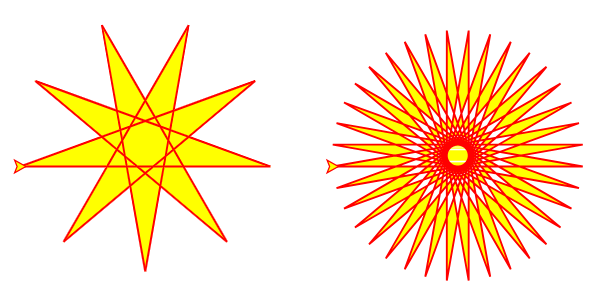

# Computational Thinking with Turtles


In today's technology-driven world, computational thinking is an essential skill for effective leadership, even without requiring you to become a programmer. This lesson demystifies computational thinking, presenting it as a powerful problem-solving framework applicable to various business challenges.

**Learning Objectives:**

By the end of this lesson, you will be able to:

* Define computational thinking and its core concepts: decomposition, abstraction, algorithmic thinking, and pattern recognition.
* Relate these concepts to familiar business practices and scenarios.
* Apply computational thinking to analyze and solve a problem using a simple coding exercise.
* Understand the importance of refactoring and iterative development in creating effective solutions.
* Appreciate the role of computational thinking in user experience design and product development.


**Lesson Overview:**

1. **Introduction to Computational Thinking:** We'll define computational thinking and explore its core concepts, providing relatable examples from the business world.
2. **Connecting to Familiar Concepts:** You'll engage in a critical thinking exercise to connect computational thinking to your own professional experiences.
3. **Introducing the Turtle Problem:**  We'll introduce a visual coding exercise using Turtle Graphics to demonstrate the practical application of computational thinking.
4. **Refactoring and Applying Concepts:**  We'll iteratively refactor the code, highlighting how each step aligns with the principles of computational thinking.
5. **Complete Code and Wrap-up:** We'll present the final refactored code, emphasizing the key takeaways and the broader relevance of computational thinking for business leaders.

This lesson provides a practical and engaging introduction to computational thinking, empowering you to apply these valuable skills in your everyday work and strategic decision-making.


### Introduction to Computational Thinking

In today's rapidly evolving digital landscape, business leaders need to be equipped with more than just traditional management skills.  Computational thinking, a problem-solving methodology rooted in computer science principles, is becoming increasingly crucial for effective decision-making and navigating the complexities of the modern business world.

While the term may seem intimidating to those without a technical background, computational thinking is not about coding. It's a mental framework applicable to various challenges, empowering you to approach problems with greater clarity and efficiency.

This approach involves four key concepts:

* **Decomposition:**  Consider the process of developing a strategic plan. It would be overwhelming to tackle the entire plan as a single entity. Instead, you would decompose it into smaller, more manageable components, such as market analysis, competitor analysis, and internal resource assessment. This is the essence of decomposition – breaking down complex problems into smaller, more manageable parts.

* **Abstraction:**  An organization chart provides a high-level view of a company's structure, highlighting key roles and reporting relationships without delving into the specifics of each employee's responsibilities. This is abstraction in action – focusing on essential information while filtering out irrelevant details. Financial reports similarly use abstraction to present key performance indicators.

* **Algorithmic Thinking:**  Standard Operating Procedures (SOPs) are a prime example of algorithmic thinking in a business context. They outline a precise sequence of steps to ensure consistency and efficiency in executing tasks.  Essentially, algorithmic thinking involves defining a step-by-step process to achieve a desired outcome.

* **Pattern Recognition:**  Analyzing sales data to identify seasonal trends is a common application of pattern recognition in business. By identifying recurring patterns or trends, you can make more informed decisions about inventory management, marketing campaigns, and other strategic initiatives. Market research relies heavily on pattern recognition to understand consumer behavior.

By mastering these concepts, you can enhance your problem-solving abilities, even without writing any code. Computational thinking helps you:

* **Analyze problems systematically**
* **Identify core issues**
* **Develop effective solutions**
* **Communicate solutions clearly and concisely**

In the following sections, we will delve deeper into each of these concepts, exploring their practical applications in various business scenarios.


### Connecting to Familiar Concepts

**Critical Thinking Exercise:**

Now that you've been introduced to the four pillars of computational thinking – decomposition, abstraction, algorithmic thinking, and pattern recognition – let's explore how these concepts connect to your existing knowledge and experience in the business world.

**Instructions:**

1. **Reflect:** Take a moment to consider your typical work tasks and responsibilities.
2. **Analyze:**  Identify specific instances where you have already applied elements of computational thinking, even without realizing it.
3. **Document:**  For each of the four concepts, write down at least one concrete example from your professional experience that demonstrates its application.

**Tips for Success:**

* **Think broadly:** Computational thinking isn't limited to technology-related tasks. Consider how you approach problem-solving, decision-making, and process optimization in general.
* **Be specific:**  Instead of general statements, provide detailed examples with context.
* **Consider different aspects of your work:**  Think about strategic planning, project management, data analysis, communication, and even routine tasks.

**Example:**

Let's say you're responsible for launching a new product. Here's how you might apply computational thinking:

* **Decomposition:** Break down the launch into smaller phases (market research, product development, marketing campaign, sales strategy, etc.).
* **Abstraction:**  Create a high-level timeline or Gantt chart that focuses on key milestones without getting bogged down in every minor detail.
* **Algorithmic Thinking:** Develop a checklist or workflow for the launch process to ensure consistency and efficiency.
* **Pattern Recognition:** Analyze data from previous product launches to identify successful strategies and potential pitfalls.

By completing this exercise, you'll gain a deeper understanding of how computational thinking is already embedded in many business practices. This awareness will help you consciously apply these concepts to become a more effective and efficient leader.


### Introducing the Turtle Problem

In this section, we'll transition from theory to practice. We'll use a simple programming environment called "Turtle Graphics" to illustrate how computational thinking can be applied to create something visual and dynamic.

> Source
>
> The original code comes from the GitHub repository of the [ColabTurtlePlus](https://github.com/mathriddle/ColabTurtlePlus/). The repository contains excellent set of [examples](https://github.com/mathriddle/ColabTurtlePlus/tree/main/examples_version2) that can be analyzed and extended for challenge assignment for Module 1. Make sure to reference the code you use for the assignment.



Now, let's take a look at the code that generates these patterns:

```python
from ColabTurtlePlus.Turtle import *
clearscreen()
setup(500,300)
T = Turtle()
T.color('red', 'yellow')
T.speed(13)
T.width(1.5)
S = T.clone()
T.fillrule("evenodd")
S.fillrule("nonzero")
x0 = -225
T.jumpto(x0,0)
S.jumpto(25,0)
T.begin_fill()
S.begin_fill()
while True:
    T.forward(200)
    T.left(170)
    S.forward(200)
    S.left(170)
    if (T.getx()-x0)**2 + T.gety()**2 < 1:
        break
T.end_fill()
S.end_fill()
```

<details markdown="block">

<summary>Annotated version of the code</summary>

```python
# Import the necessary library for turtle graphics.
from ColabTurtlePlus.Turtle import *

# Clear the screen to start fresh.
clearscreen()

# Set up the drawing area with a width of 500 pixels and a height of 300 pixels.
setup(500,300)

# Create a turtle object and name it 'T'. This is like your pen for drawing.
T = Turtle()

# Set the turtle's color. The first color is for the line, the second for filling shapes.
T.color('red', 'yellow')

# Set the turtle's drawing speed. 13 is quite fast.
T.speed(13)

# Set the width of the line the turtle draws.
T.width(1.5)

# Create a clone of the first turtle, named 'S'. Now we have two 'pens'!
S = T.clone()

# This determines how overlapping shapes are filled. 
# "evenodd" means areas overlapped an odd number of times are filled, 
# "nonzero" means any overlapped area is filled.
T.fillrule("evenodd")
S.fillrule("nonzero")

# Set a starting x-coordinate.
x0 = -225

# Move the turtles to their starting positions without drawing a line.
T.jumpto(x0,0)
S.jumpto(25,0)

# Start filling the shapes the turtles are about to draw.
T.begin_fill()
S.begin_fill()

# This loop makes the turtles draw until a condition is met.
while True:
    # Move the turtle 'T' forward 200 pixels.
    T.forward(200)
    # Turn the turtle 'T' left by 170 degrees.
    T.left(170)
    # Move the turtle 'S' forward 200 pixels.
    S.forward(200)
    # Turn the turtle 'S' left by 170 degrees.
    S.left(170)
    # This checks if the turtle 'T' is back near its starting point. 
    # It uses a bit of math (Pythagorean theorem) to calculate the distance.
    if (T.getx()-x0)**2 + T.gety()**2 < 1:
        # If the turtle is close enough, exit the loop.
        break

# Stop filling the shapes.
T.end_fill()
S.end_fill()
```

</details>


Don't worry if it looks like gibberish right now! We'll break it down step-by-step in the following sections. 


**The Challenge:**

Your challenge is to understand this code and then modify it to create your own unique patterns. This will involve applying the concepts of computational thinking we've discussed:

* **Decomposition:** How can you break down this code into smaller, more manageable parts?

<details>
  <summary>Click to reveal answer</summary>
  <blockquote class="highlight" style="margin-left: 2rem;">
<p>You can decompose this code by identifying distinct blocks of functionality:</p>
<ul>
  <li><strong>Setup:</strong> The lines that import the library, clear the screen, and set up the drawing area (<code>from ColabTurtlePlus...</code>, <code>clearscreen()</code>, <code>setup()</code>).</li>
  <li><strong>Turtle Initialization:</strong> The lines that create the turtle objects and set their properties (<code>T = Turtle()</code>, <code>T.color()</code>, <code>T.speed()</code>, etc.).</li>
  <li><strong>Movement and Drawing:</strong> The <code>while True</code> loop that contains the instructions for the turtles to move and turn.</li>
  <li><strong>Filling:</strong> The lines that start and end the filling of the shapes (<code>T.begin_fill()</code>, <code>T.end_fill()</code>).</li>
</ul>
<p>By separating these parts, you can focus on understanding and modifying each piece individually.</p>
</blockquote>
</details>

* **Abstraction:** Can you identify any elements that are abstracted away or hidden from the user?

<details>
  <summary>Click to reveal answer</summary>
<blockquote class="highlight" style="margin-left: 2rem;">

  <p>Yes, several elements are abstracted in this code:</p>
<ul>
  <li><strong>Turtle commands:</strong> Commands like <code>forward()</code>, <code>left()</code>, and <code>jumpto()</code> abstract away the complex mathematics involved in moving and drawing on the screen. You don't need to know trigonometry or geometry to use them.</li>
  <li><strong>Library functions:</strong> The functions provided by the <code>ColabTurtlePlus.Turtle</code> library abstract away the lower-level code that interacts with the computer's graphics system.</li>
  <li><strong>Fill rule:</strong> The <code>fillrule</code> option abstracts the complexities of how overlapping shapes are filled.</li>
</ul>
<p>Abstraction simplifies the code, allowing you to focus on the desired outcome without getting bogged down in the underlying implementation details.</p>
</blockquote>
</details>

* **Algorithmic Thinking:** What is the core algorithm that generates the pattern?

<details>
  <summary>Click to reveal answer</summary>
  <blockquote class="highlight" style="margin-left: 2rem;">

<p>The core algorithm is within the <code>while True</code> loop:</p>
<ol>
  <li>Move the turtle forward by a certain distance (<code>T.forward(200)</code>).</li>
  <li>Turn the turtle left by a certain angle (<code>T.left(170)</code>).</li>
  <li>Repeat these steps until the turtle returns to its starting position.</li>
</ol>
<p>This simple algorithm, when executed repeatedly, generates the complex spiral patterns.</p>
</blockquote>
</details>

* **Pattern Recognition:** Can you identify any patterns in the code itself, and how do those patterns translate into the visual output?

<details>
  <summary>Click to reveal answer</summary>
<blockquote class="highlight" style="margin-left: 2rem;">
<p>The most obvious pattern is the repetition of the <code>forward()</code> and <code>left()</code> commands within the loop. This repetition creates the spiral shape.</p>
<p>The specific values used for distance and angle determine the tightness and overall form of the spiral. Experimenting with these values will result in different visual patterns.</p>
<p>By recognizing these patterns in the code, you can predict how changes to the code will affect the visual output.</p>
</blockquote>
</details>

### Refactoring and Applying Concepts

Now it's time to roll up our sleeves and get hands-on with the code! We'll take the turtle graphics program and refactor it step-by-step. Remember that refactoring simply means improving the code's structure and readability without changing its functionality.  In the real world, code is rarely perfect from the start. We engage in continuous development, iteratively refining and improving it. Sometimes, the areas that need improvement aren't obvious. Just as in business, we experiment with changes and rely on data to guide our decisions. A/B testing helps us understand user preferences for user-facing changes, while performance testing guides optimizations for speed and efficiency. With each iteration, we'll see how computational thinking principles guide our refactoring decisions.

**Iteration 1: Identifying the Algorithm**

Let's revisit the code:

```python
from ColabTurtlePlus.Turtle import *
clearscreen()
setup(500,300)
T = Turtle()
T.color('red', 'yellow')
T.speed(13)
T.width(1.5)
S = T.clone()
T.fillrule("evenodd")
S.fillrule("nonzero")
x0 = -225
T.jumpto(x0,0)
S.jumpto(25,0)
T.begin_fill()
S.begin_fill()
while True:
    T.forward(200)
    T.left(170)
    S.forward(200)
    S.left(170)
    if (T.getx()-x0)**2 + T.gety()**2 < 1:
        break
T.end_fill()
S.end_fill()
```

Can you spot the core algorithm that generates the spiral pattern?

<details>
  <summary>Click to reveal answer</summary>
<blockquote class="highlight">
  <p>It's the <code>while True</code> loop! This loop repeatedly instructs the turtles to move forward and turn left, creating the spiral shape.</p>
  <pre><code>while True:
      T.forward(200)
      T.left(170)
      S.forward(200)
      S.left(170)
      if (T.getx()-x0)**2 + T.gety()**2 &lt; 1:
          break
  </code></pre>
  <p>This is <strong>algorithmic thinking</strong> in action - defining a precise sequence of steps to achieve a desired outcome.</p>
</blockquote>
</details>

**Iteration 2: Abstraction with a Function**

To make the code more organized and reusable, let's encapsulate this algorithm within a function:

```python
def draw_spiral(turtle_obj, step_size, angle):
  x0 = turtle_obj.getx()
  turtle_obj.begin_fill()
  while True:
      turtle_obj.forward(step_size)
      turtle_obj.left(angle)
      if (turtle_obj.getx() - x0)**2 + turtle_obj.gety()**2 < 1:
          break
  turtle_obj.end_fill()

# Now you can use the function like this:
draw_spiral(T, 200, 170)  # For turtle T
draw_spiral(S, 200, 170)  # For turtle S 
```

What have we achieved here?

<details>
  <summary>Click to reveal answer</summary>
<blockquote class="highlight">
  <p>We've created an <strong>abstraction</strong>! The <code>draw_spiral()</code> function hides the complexity of the algorithm. Now, someone using this function doesn't need to understand the details of the loop or the math involved. They can simply call the function with the desired parameters: the turtle object, step size, and angle.</p>
  <p>This is similar to using a function in a spreadsheet software. You don't need to know the formula behind <code>SUM()</code> or <code>AVERAGE()</code>, you just need to know what inputs it requires.</p>
</blockquote>
</details>

**Iteration 3: Abstraction and Progressive Disclosure with Default Arguments**

In the previous iteration, we abstracted the spiral drawing logic into a function. Now, let's further simplify the code by creating a function to set up our turtles:

```python
def create_turtle(color1='red', color2='yellow', speed=13, width=1.5, fillrule="evenodd"):
  """
  Creates a turtle object with specified properties.

  Args:
    color1: The color of the turtle's pen.
    color2: The fill color of the turtle.
    speed: The drawing speed of the turtle.
    width: The width of the turtle's pen.
    fillrule: The fill rule for the turtle.

  Returns:
    A Turtle object with the specified properties.
  """
  T = Turtle()
  T.color(color1, color2)
  T.speed(speed)
  T.width(width)
  T.fillrule(fillrule)
  return T

# Now you can create turtles like this:
T1 = create_turtle()  # Uses all default values
T2 = create_turtle('blue', 'green', fillrule="nonzero")  # Overrides some defaults
```

Notice how we've provided default values for all the arguments in the `create_turtle()` function. This allows users to create a turtle with the standard settings by simply calling the function without any arguments (`T1 = create_turtle()`).  However, if they need to customize the turtle's properties, they can provide specific values for any of the arguments, like we did for `T2`.

This demonstrates two important concepts:

* **Abstraction:**  The function hides the details of creating and configuring a turtle object, making the code cleaner and easier to use.
* **Progressive Disclosure:**  By providing default values, we simplify the initial interaction for users. They don't need to be overwhelmed with all the possible options right away. They can start with the defaults and then progressively explore more advanced customizations as needed.

This principle of progressive disclosure is widely used in software design. Think about the settings menu on your phone. The most commonly used settings are readily accessible, while more advanced options are tucked away in submenus. This makes the user experience less daunting and more efficient.

By using default arguments in our code, we're applying the same principle, making it easier for others (or even our future selves) to use and understand our code.

**Iteration 4: Decomposition for Clarity**

Let's break down the setup and drawing actions into separate functions:

```python
def create_turtle(color1='red', color2='yellow', speed=13, width=1.5, fillrule="evenodd"):
  """Creates a turtle object with specified properties."""
  T = Turtle()
  T.color(color1, color2)
  T.speed(speed)
  T.width(width)
  T.fillrule(fillrule)
  return T

def draw_spirals(turtle1, turtle2, step_size, angle):
  """Sets up two turtles and draws spirals with them."""
  x0 = -225  # Set a starting x-coordinate
  turtle1.jumpto(x0, 0)
  turtle2.jumpto(25, 0)
  draw_spiral(turtle1, step_size, angle)
  draw_spiral(turtle2, step_size, angle)

# Now the main part of the program becomes very concise:
clearscreen()
setup(500, 300)

T1 = create_turtle()
T2 = create_turtle('blue', 'green', fillrule="nonzero")

draw_spirals(T1, T2, 200, 170) 
```

By decomposing the code into these functions, we've made it:

* **More Modular:** Each function performs a specific task, making the code easier to understand and maintain.
* **More Reusable:**  The `create_turtle()` function can be used to create turtles with different properties throughout the program.
* **More Readable:** The main part of the program now clearly shows the high-level steps: create turtles, draw spirals.

This refactoring highlights how decomposition can be used to organize and simplify complex tasks, a principle that applies not only to coding but also to various business processes.  It also shows how breaking down a problem into smaller parts can make it easier to manage and solve, a key aspect of computational thinking.


**Iteration 5: Data Structuring and Tuple Unpacking**

Let's say we want to draw two spirals with different properties (step size and angle). We can group the relevant data for each spiral using tuples.

```python
def create_turtle(color1='red', color2='yellow', speed=13, width=1.5, fillrule="evenodd"):
  """Creates a turtle object with specified properties."""
  T = Turtle()
  T.color(color1, color2)
  T.speed(speed)
  T.width(width)
  T.fillrule(fillrule)
  return T

def draw_spirals(turtle1_data, turtle2_data):
  """Sets up two turtles and draws spirals with them."""
  x0 = -225  # Set a starting x-coordinate
  turtle1, step_size1, angle1 = turtle1_data  # Unpack the tuple
  turtle2, step_size2, angle2 = turtle2_data  # Unpack the tuple
  turtle1.jumpto(x0, 0)
  turtle2.jumpto(25, 0)
  draw_spiral(turtle1, step_size1, angle1)  # Call with unpacked values
  draw_spiral(turtle2, step_size2, angle2)  # Call with unpacked values

def draw_spiral(turtle_obj, step_size, angle):
  """Draws a spiral with the given turtle object."""
  x0 = turtle_obj.getx()
  turtle_obj.begin_fill()
  while True:
      turtle_obj.forward(step_size)
      turtle_obj.left(angle)
      if (turtle_obj.getx() - x0)**2 + turtle_obj.gety()**2 < 1:
          break
  turtle_obj.end_fill()

# Now the main part of the program:
clearscreen()
setup(500, 300)

T1 = create_turtle()
T2 = create_turtle('blue', 'green', fillrule="nonzero")

# Create tuples to store turtle data
turtle1_data = (T1, 200, 170)  
turtle2_data = (T2, 150, 120)  

draw_spirals(turtle1_data, turtle2_data)
```

* We create tuples (`turtle1_data`, `turtle2_data`) to store the turtle object, step size, and angle together. This helps organize related data.
* In `draw_spirals`, we use tuple unpacking to assign the individual elements of the tuples to separate variables.
* When calling `draw_spiral`, we pass these unpacked values as arguments.

This demonstrates:

* **Data Structuring:** Using tuples to group related data.
* **Tuple Unpacking:**  A convenient way to access elements of a tuple.
* **Decomposition:**  The `draw_spirals` function now clearly decomposes the task of drawing two spirals with different properties by calling the `draw_spiral` function twice with different parameters.

### Complete Code and Wrap-up

Throughout this lesson, we've explored the core concepts of computational thinking – decomposition, abstraction, algorithmic thinking, and pattern recognition – and applied them to refactor a simple turtle graphics program.  Let's take a look at the final version of the code:

```python
from ColabTurtlePlus.Turtle import *

def create_turtle(color1='red', color2='yellow', speed=13, width=1.5, fillrule="evenodd"):
  """Creates a turtle object with specified properties."""
  T = Turtle()
  T.color(color1, color2)
  T.speed(speed)
  T.width(width)
  T.fillrule(fillrule)
  return T

def draw_spirals(turtle1_data, turtle2_data):
  """Sets up two turtles and draws spirals with them."""
  x0 = -225  # Set a starting x-coordinate
  turtle1, step_size1, angle1 = turtle1_data  # Unpack the tuple
  turtle2, step_size2, angle2 = turtle2_data  # Unpack the tuple
  turtle1.jumpto(x0, 0)
  turtle2.jumpto(25, 0)
  draw_spiral(turtle1, step_size1, angle1)  # Call with unpacked values
  draw_spiral(turtle2, step_size2, angle2)  # Call with unpacked values

def draw_spiral(turtle_obj, step_size, angle):
  """Draws a spiral with the given turtle object."""
  x0 = turtle_obj.getx()
  turtle_obj.begin_fill()
  while True:
      turtle_obj.forward(step_size)
      turtle_obj.left(angle)
      if (turtle_obj.getx() - x0)**2 + turtle_obj.gety()**2 < 1:
          break
  turtle_obj.end_fill()

# Main part of the program:
clearscreen()
setup(500, 300)

T1 = create_turtle()
T2 = create_turtle('blue', 'green', fillrule="nonzero")

# Create tuples to store turtle data
turtle1_data = (T1, 200, 170)  
turtle2_data = (T2, 150, 120)  

draw_spirals(turtle1_data, turtle2_data)
```

> Lesson Colab Notebook
>
> The interactive notebook version of this code is available on the course [GitHub Repository](https://github.com/computational-thinking-4-business/computational-thinking-4-business.github.io/tree/main/notebooks).

**Connecting to Foundational Concepts:**

* **Decomposition:** We broke down the original code into smaller, more manageable functions (`create_turtle`, `draw_spirals`, `draw_spiral`). This made the code easier to understand, test, and modify.
* **Abstraction:** We used functions to hide the complexity of certain tasks, such as creating a turtle object and drawing a spiral. This allowed us to use these functions without needing to know the underlying details.
* **Algorithmic Thinking:** We defined a clear algorithm for drawing a spiral using a `while` loop and the `forward` and `left` commands.
* **Pattern Recognition:** We identified patterns in the code, such as the repetition of commands within the loop, and used this understanding to create different visual patterns. Pattern recognition extends beyond just identifying patterns in data or code. It also involves understanding user needs and behaviors to design more effective and user-friendly solutions. This is crucial in areas like UX design and product development.

**Key Takeaways:**

* Computational thinking is a powerful problem-solving approach that can be applied to various domains, even without extensive coding experience.
* By understanding and applying concepts like decomposition, abstraction, algorithmic thinking, and pattern recognition, you can improve your problem-solving skills and approach challenges with greater clarity and efficiency.
* Even simple coding exercises, like the turtle graphics example, can provide valuable insights into the principles of computational thinking and their practical applications.

This concludes the lesson on computational thinking with turtle graphics. We encourage you to experiment with the code, modify it to create your own patterns, and continue exploring the fascinating world of computational thinking!

### References

- [turtle](https://docs.python.org/3/library/turtle.html) - Python standard library package documentation
- [ColabTurtlePlus](https://github.com/mathriddle/ColabTurtlePlus) - Python package for turtle graphics on Colab notebooks
- [Turtle Star](https://github.com/mathriddle/ColabTurtlePlus/blob/main/examples_version2/TurtleStar.md) - Turtle star example from ColabTurtlePlus GitHub Repository.
- [Exploring Computational Thinking](https://edu.google.com/resources/programs/exploring-computational-thinking/) - Google for Education course resources
- [Introduction to Computational Thinking](https://www.bbc.co.uk/bitesize/guides/zp92mp3/revision/1) What is Computational Thinking?
